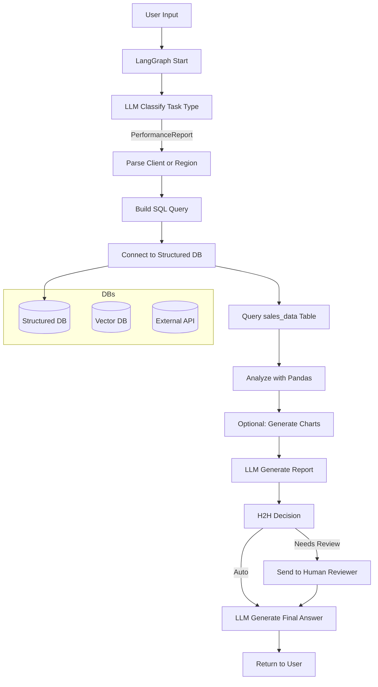

# 🚀 LangGraph 기반 성과 보고서 시스템

OpenAI GPT-4o와 LangGraph를 활용하여 Excel 데이터를 분석하고 전문적인 성과 보고서를 자동 생성하는 AI 시스템입니다.


## ✨ 주요 기능

- 📊 **Excel 데이터 자동 분석**: 357행의 매출 데이터를 SQLite 데이터베이스로 변환
- 🤖 **AI 기반 보고서 생성**: 자연어 요청으로 전문적인 성과 보고서 자동 생성
- 📈 **시각화**: 월별 트렌드 차트 및 그래프 자동 생성 (2019-12 ~ 2020-11)
- 🔄 **LangGraph 워크플로우**: 9단계 체계적인 AI 작업 흐름 관리
- 🌐 **웹 인터페이스**: Streamlit 기반의 사용자 친화적 UI
- 💬 **채팅 인터페이스**: 자연어로 대화하며 보고서 요청
- 🛡️ **H2H 검토 시스템**: 복잡한 분석에 대한 사람의 검토 권장
- 🔄 **자동 시스템 확인**: 앱 시작 시 데이터베이스와 AI 시스템 자동 상태 확인
- 🔍 **실시간 상태 모니터링**: 시스템 상태를 실시간으로 확인 및 재초기화

## 🏗️ 시스템 아키텍처



## 📦 설치 및 설정

### 1. 필수 요구사항

- Python 3.8 이상
- OpenAI API 키

### 2. 패키지 설치

```bash
pip install -r requirements.txt
```

### 3. 환경 설정

`.env` 파일을 생성하고 다음 내용을 추가하세요:

```env
OPENAI_API_KEY=your_openai_api_key_here
LANGCHAIN_TRACING_V2=true
LANGCHAIN_ENDPOINT=https://api.smith.langchain.com
LANGCHAIN_API_KEY=your_langsmith_api_key_here
LANGCHAIN_PROJECT=performance-report-project
```

### 4. 데이터 준비

- `data.xlsx` 파일이 프로젝트 루트에 있는지 확인하세요.
- Excel 파일은 월별 매출 데이터를 포함해야 합니다.

## 🚀 사용법

### 방법 1: 웹 인터페이스 (권장)

**Windows PowerShell에서:**
```powershell
python run.py --mode web
```

**또는 직접 Streamlit 실행:**
```powershell
streamlit run app.py
```

웹 브라우저에서 `http://localhost:8501`로 접속하여 사용하세요.

### 방법 2: 콘솔 모드

```powershell
python run.py --mode console
```

### 방법 3: 데이터만 설정

```powershell
python run.py --mode setup
```

### ⚠️ PowerShell 사용자 주의사항

PowerShell에서는 `&&` 연산자 대신 `;`를 사용하거나 명령을 분리하여 실행하세요:

```powershell
# 잘못된 방법
cd "프로젝트폴더" && python run.py

# 올바른 방법
cd "프로젝트폴더"; python run.py
# 또는
cd "프로젝트폴더"
python run.py
```

## 📱 웹 인터페이스 사용법

1. **데이터베이스 초기화**: 사이드바에서 "🔄 데이터베이스 초기화" 버튼 클릭
2. **AI 시스템 초기화**: 사이드바에서 "🚀 AI 시스템 초기화" 버튼 클릭
3. **보고서 요청**: "💬 AI 채팅" 탭에서 자연어로 보고서 요청

### 📋 실제 데이터 구조

현재 시스템에 로드된 데이터:
- **총 레코드**: 357행
- **기간**: 2019년 12월 ~ 2020년 11월 (12개월)
- **주요 컬럼**: ID, 품목, 함량, 월별 매출 데이터

### 💬 예시 요청

**전체 분석:**
- "전체 매출 현황 보고서를 만들어주세요"
- "2020년 전체 실적을 요약해주세요"

**제품별 분석:**
- "뉴렙톨 제품의 실적을 분석해주세요"
- "가스몬 매출 트렌드를 보여주세요"
- "그란닥신의 월별 판매량을 분석해주세요"

**기간별 분석:**
- "2020년 상반기와 하반기를 비교해주세요"
- "월별 트렌드를 시각화해주세요"
- "가장 높은 매출을 기록한 월을 찾아주세요"

**의료기관별 분석:**
- "굿모닝신경과의원의 매출 현황을 분석해주세요"
- "특정 병원의 제품별 판매 실적을 보여주세요"

## 📁 프로젝트 구조

```
Generate Performance Report_test/
├── data.xlsx                 # 원본 Excel 데이터
├── requirements.txt          # Python 패키지 목록
├── .env                     # 환경 변수 설정 (생성 필요)
├── run.py                   # 메인 실행 스크립트
├── app.py                   # Streamlit 웹 애플리케이션
├── data_processor.py        # Excel 데이터 처리 및 DB 변환
├── langgraph_system.py      # LangGraph 기반 AI 시스템
├── sales_data.db           # SQLite 데이터베이스 (자동 생성)
├── data_analysis.json      # 데이터 분석 결과 (자동 생성)
└── chart_*.png             # 생성된 차트 파일들 (자동 생성)
```

## 🔧 주요 컴포넌트

### 1. DataProcessor (`data_processor.py`)
- Excel 파일을 SQLite 데이터베이스로 변환
- 데이터 구조 분석 및 메타데이터 생성
- 데이터베이스 연결 테스트

### 2. PerformanceReportSystem (`langgraph_system.py`)
- LangGraph 기반 AI 워크플로우 구현
- 사용자 입력 분류 및 처리
- SQL 쿼리 생성 및 실행
- 데이터 분석 및 시각화
- AI 기반 보고서 생성

### 3. Streamlit App (`app.py`)
- 웹 기반 사용자 인터페이스
- 실시간 채팅 인터페이스
- 데이터 개요 및 시각화
- 시스템 상태 모니터링

## 🎯 LangGraph 워크플로우

1. **Task Classification**: 사용자 입력을 성과 보고서 요청으로 분류
2. **Client/Region Parsing**: 특정 클라이언트나 지역 정보 추출
3. **SQL Query Building**: 동적 SQL 쿼리 생성
4. **Database Query**: SQLite 데이터베이스에서 데이터 조회
5. **Data Analysis**: Pandas를 사용한 데이터 분석
6. **Chart Generation**: Matplotlib/Plotly를 사용한 시각화
7. **Report Generation**: GPT-4o를 사용한 전문 보고서 생성
8. **H2H Decision**: 사람의 검토 필요성 판단
9. **Final Answer**: 최종 결과 반환

## 🔍 예시 출력

### 생성되는 보고서 구조

1. **요약 (Executive Summary)**
   - 핵심 성과 지표 요약
   - 주요 인사이트

2. **주요 지표 분석**
   - 매출액, 성장률 등 핵심 KPI
   - 전년 동기 대비 분석

3. **트렌드 분석**
   - 월별/분기별 트렌드
   - 계절성 패턴 분석

4. **인사이트 및 권장사항**
   - 데이터 기반 인사이트
   - 향후 전략 제안

## 🛠️ 커스터마이징

### 새로운 분석 기능 추가

1. `langgraph_system.py`에서 새로운 노드 추가
2. 워크플로우 그래프에 노드 연결
3. 라우팅 로직 업데이트

### 데이터 소스 변경

1. `data_processor.py`에서 데이터 로딩 로직 수정
2. SQL 쿼리 생성 로직 업데이트
3. 컬럼명 매핑 조정

## 📊 지원하는 데이터 형식

- **Excel 파일**: .xlsx, .xls
- **CSV 파일**: 확장 가능
- **데이터베이스**: SQLite, PostgreSQL (확장 가능)

## 🚨 문제 해결

### 일반적인 오류

1. **OpenAI API 키 오류**
   ```
   Error: Invalid API key provided
   ```
   - `.env` 파일에서 `OPENAI_API_KEY` 확인
   - API 키가 올바른 형식인지 확인 (sk-로 시작)

2. **PowerShell 명령어 오류**
   ```
   '&&' 토큰은 이 버전에서 올바른 문 구분 기호가 아닙니다.
   ```
   - `&&` 대신 `;` 사용하거나 명령을 분리하여 실행

3. **패키지 설치 오류**
   ```
   Missing optional dependency 'openpyxl'
   ```
   - 필요한 패키지 설치: `pip install -r requirements.txt`

4. **데이터베이스 연결 오류**
   - `sales_data.db` 파일 권한 확인
   - 데이터베이스 재생성: `python run.py --force-setup`

5. **Streamlit 세션 상태 오류**
   ```
   데이터베이스 미준비 / AI 시스템 미준비
   ```
   - **해결됨**: 자동 시스템 상태 확인 기능 추가
   - 사이드바의 "🔍 시스템 상태 재확인" 버튼 클릭
   - 또는 "🔄 데이터베이스 초기화" / "🚀 AI 시스템 초기화" 버튼 클릭

6. **Excel 파일 오류**
   ```
   TypeError: keys must be str, int, float, bool or None, not datetime
   ```
   - 이미 수정됨: datetime 컬럼명이 자동으로 문자열로 변환됨
   - `data.xlsx` 파일 존재 및 형식 확인

### 🔧 문제 해결 단계

1. **환경 확인**
   ```powershell
   python --version  # Python 3.8+ 확인
   pip list | Select-String "streamlit|langchain|pandas"
   ```

2. **데이터베이스 재생성**
   ```powershell
   python run.py --force-setup
   ```

3. **로그 확인**
   ```powershell
   python run.py --mode console
   ```

4. **Streamlit 캐시 클리어**
   ```powershell
   streamlit cache clear
   ```

### 💡 성능 최적화

- **메모리 사용량 확인**: 큰 데이터셋의 경우 청크 단위로 처리
- **API 호출 최적화**: 요청을 명확하고 구체적으로 작성
- **차트 생성 속도**: 데이터 포인트가 많은 경우 샘플링 사용

## 🤝 기여하기

1. Fork the repository
2. Create a feature branch
3. Commit your changes
4. Push to the branch
5. Create a Pull Request

## 📄 라이선스

이 프로젝트는 MIT 라이선스 하에 제공됩니다.

## 📞 지원

문제가 발생하거나 질문이 있으시면 이슈를 등록해주세요.

---

**Made with ❤️ using LangGraph, OpenAI GPT-4o, and Streamlit** 