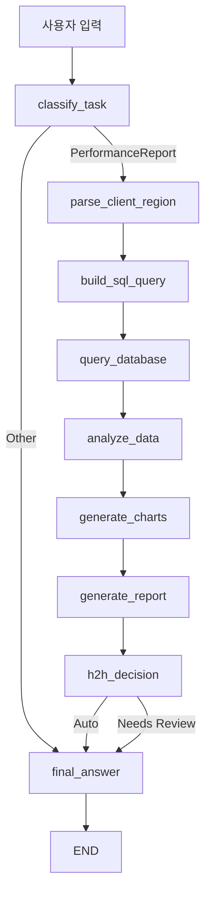

# 🚀 LangGraph 기반 성과 보고서 시스템 구조 분석 보고서

## 📋 Executive Summary

본 보고서는 OpenAI GPT-4o와 LangGraph를 활용한 성과 보고서 자동 생성 시스템의 내부 구조와 Human-in-the-Loop (H2H) 기능을 상세히 분석합니다. 시스템은 9개의 연결된 노드로 구성된 방향성 그래프 구조를 통해 사용자 입력부터 최종 보고서 생성까지의 전 과정을 체계적으로 처리합니다.

## 🏗️ 1. LangGraph 아키텍처 분석

### 1.1 GraphState 구조

시스템의 모든 상태 정보를 관리하는 핵심 데이터 구조:

```python
class GraphState(TypedDict):
    messages: Annotated[list, add_messages]      # 사용자와의 대화 내역
    task_type: str                               # 작업 분류 (PerformanceReport/Other)
    client_or_region: str                        # 추출된 클라이언트/지역 정보
    sql_query: str                               # 생성된 SQL 쿼리
    query_result: pd.DataFrame                   # 데이터베이스 조회 결과
    analysis_result: Dict[str, Any]              # Pandas 분석 결과
    chart_path: Optional[str]                    # 생성된 차트 파일 경로
    report: str                                  # LLM이 생성한 보고서
    needs_human_review: bool                     # H2H 검토 필요 여부
    final_answer: str                            # 최종 사용자 응답
```

### 1.2 노드별 상세 분석

#### 🎯 Node 1: classify_task (작업 분류)
- **역할**: 사용자 입력을 분석하여 작업 타입 결정
- **입력**: `messages` (사용자 메시지)
- **출력**: `task_type` ("PerformanceReport" 또는 "Other")
- **LLM 사용**: GPT-4o로 의도 분류
- **예시**: "굿모닝신경과의원 성과 보고서" → "PerformanceReport"

#### 🔍 Node 2: parse_client_region (대상 추출)
- **역할**: 특정 클라이언트, 제품, 지역 정보 추출
- **입력**: `messages` (사용자 메시지)
- **출력**: `client_or_region` (추출된 키워드 또는 "전체")
- **LLM 사용**: 엔티티 추출 및 정규화
- **예시**: "굿모닝신경과의원 및 뉴렙톨" → "굿모닝신경과의원"

#### 🛠️ Node 3: build_sql_query (쿼리 생성)
- **역할**: 추출된 정보를 기반으로 SQL 쿼리 생성
- **입력**: `client_or_region`
- **출력**: `sql_query`
- **로직**: 
  - "전체" → `SELECT * FROM sales_data`
  - 특정 키워드 → `WHERE (ID LIKE '%키워드%' OR 품목 LIKE '%키워드%' OR 함량 LIKE '%키워드%')`

#### 💾 Node 4: query_database (데이터 조회)
- **역할**: SQLite 데이터베이스에서 실제 데이터 조회
- **입력**: `sql_query`
- **출력**: `query_result` (pandas DataFrame)
- **오류 처리**: 실패 시 빈 DataFrame 반환

#### 📊 Node 5: analyze_data (데이터 분석)
- **역할**: Pandas를 사용한 기술 통계 및 월별 분석
- **입력**: `query_result`
- **출력**: `analysis_result`
- **분석 항목**:
  - 총 레코드 수
  - 기본 통계 (mean, std, min, max, percentiles)
  - 월별 매출 합계 (2019-12 ~ 2024-XX 형태 인식)

#### 📈 Node 6: generate_charts (시각화)
- **역할**: Matplotlib을 사용한 월별 트렌드 차트 생성
- **입력**: `query_result`, `analysis_result`
- **출력**: `chart_path` (PNG 파일 경로)
- **생성 조건**: 월별 데이터가 존재할 때만
- **파일명**: `chart_YYYYMMDD_HHMMSS.png`

#### 📝 Node 7: generate_report (보고서 생성)
- **역할**: GPT-4o를 사용한 전문적인 성과 보고서 작성
- **입력**: `analysis_result`, `client_or_region`
- **출력**: `report`
- **구조**: 
  1. 요약 (Executive Summary)
  2. 주요 지표 분석
  3. 트렌드 분석
  4. 인사이트 및 권장사항

#### 🤝 Node 8: h2h_decision (H2H 결정)
- **역할**: 사람의 검토 필요성 자동 판단
- **입력**: `analysis_result`
- **출력**: `needs_human_review`
- **결정 로직**: (자세한 분석은 섹션 2 참조)

#### ✅ Node 9: final_answer (최종 응답)
- **역할**: 사용자에게 전달할 최종 메시지 구성
- **입력**: 모든 이전 상태 정보
- **출력**: `final_answer`
- **H2H 분기**: 검토 필요 시 경고 메시지 포함

### 1.3 워크플로우 흐름



## 🤝 2. Human-in-the-Loop (H2H) 기능 상세 분석

### 2.1 H2H 결정 알고리즘

```python
def h2h_decision(self, state: GraphState) -> GraphState:
    analysis = state["analysis_result"]
    needs_review = False
    
    if "error" in analysis:                              # 조건 1: 오류 발생
        needs_review = True
    elif analysis.get("총_레코드_수", 0) == 0:          # 조건 2: 데이터 부재
        needs_review = True
    elif len(analysis.get("월별_분석", {})) == 0:        # 조건 3: 월별 데이터 부재
        needs_review = True
    else:                                               # 정상 케이스
        needs_review = False
```

### 2.2 H2H 트리거 조건 분석

#### 🚨 조건 1: 데이터 분석 오류
- **발생 상황**: `analyze_data` 단계에서 예외 발생
- **원인 예시**: 
  - 데이터 타입 불일치
  - 메모리 부족
  - 컬럼명 오류
- **결과**: `analysis_result = {"error": "데이터가 없습니다."}`

#### 📭 조건 2: 검색 결과 없음
- **발생 상황**: SQL 쿼리 결과가 0행
- **원인 예시**:
  - 존재하지 않는 클라이언트명 검색
  - 오타가 포함된 제품명
  - 데이터베이스에 해당 기간 데이터 없음
- **실제 사례**: "존재하지않는회사" 검색 시

#### 📊 조건 3: 월별 데이터 부재
- **발생 상황**: 데이터는 있지만 시계열 분석 불가
- **원인 예시**:
  - 월별 컬럼이 없는 데이터
  - 일회성 거래 데이터만 존재
  - 날짜 형식 불일치
- **영향**: 트렌드 분석 및 차트 생성 불가

### 2.3 H2H 실행 사례 분석

#### ✅ 성공 사례: 굿모닝신경과의원
**실행 로그 분석:**
```
생성된 SQL 쿼리: SELECT * FROM sales_data WHERE (ID LIKE '%굿모닝신경과의원%' OR 품목 LIKE '%굿모닝신경과의원%' OR 함량 LIKE '%굿모닝신경과의원%')
쿼리 결과: 51행 반환됨
월별 컬럼 발견: ['2019-12', '2020-01', '2020-02', ..., '2020-11']
월별 데이터 합계: 12개월간 총 163,031,655원
H2H 결정: 정상 데이터 - 자동 처리 (레코드: 51, 월별 데이터: 12)
```

**H2H 평가 결과:**
- ✅ 오류 없음 (`"error"` 키 없음)
- ✅ 데이터 존재 (51행 > 0)
- ✅ 월별 데이터 완전 (12개월 데이터 존재)
- **최종 결정**: `needs_human_review = False` → 자동 처리

#### ❌ 실패 사례 예시: 존재하지 않는 데이터

**가상 시나리오:**
```python
# 사용자 입력: "ABC제약회사 성과 분석"
# SQL 쿼리: SELECT * FROM sales_data WHERE (ID LIKE '%ABC제약회사%' OR ...)
# 결과: 0행 반환
```

**H2H 평가:**
- ✅ 오류 없음
- ❌ 데이터 부재 (0행)
- ❌ 월별 데이터 없음
- **최종 결정**: `needs_human_review = True` → 사람 검토 필요

### 2.4 H2H 출력 메시지 차이

#### 🤖 자동 처리 시
```
분석 결과: {실제 보고서 내용}

📊 차트가 생성되었습니다: chart_20250707_232835.png
```

#### 👨‍💼 사람 검토 필요 시
```
성과 보고서가 생성되었지만 사람의 검토가 필요합니다.

{생성된 보고서 또는 오류 메시지}
```

## 📊 3. 실제 실행 사례: 데이터 흐름 추적

### 3.1 사용자 입력 → 최종 출력 전 과정

**입력**: "굿모닝신경과의원 및 뉴렙톨 성과 보고서를 만들어주세요"

#### Step 1: classify_task
- **GPT-4o 분류**: "PerformanceReport"
- **라우팅**: performance_report 경로로 이동

#### Step 2: parse_client_region  
- **GPT-4o 추출**: "굿모닝신경과의원"
- **정규화**: 핵심 키워드 식별

#### Step 3: build_sql_query
- **생성된 쿼리**: 
```sql
SELECT * FROM sales_data 
WHERE (ID LIKE '%굿모닝신경과의원%' 
    OR 품목 LIKE '%굿모닝신경과의원%' 
    OR 함량 LIKE '%굿모닝신경과의원%')
```

#### Step 4: query_database
- **조회 결과**: 51행 × 15열 DataFrame
- **데이터 샘플**: 가스몬, 그란닥신, 뉴렙톨 등 5개 제품

#### Step 5: analyze_data
- **기본 분석**:
  - 총 레코드: 51행
  - 컬럼 수: 15개
  - 숫자형 컬럼: 12개 (월별 매출)
- **월별 분석**:
  - 2019-12: 12,335,411원
  - 2020-01: 12,987,004원
  - ... (총 12개월)
  - 2020-11: 15,184,268원

#### Step 6: generate_charts
- **차트 유형**: 선 그래프 (월별 트렌드)
- **파일명**: `chart_20250707_232835.png`
- **주의사항**: 한글 폰트 경고 (기능상 문제 없음)

#### Step 7: generate_report
- **GPT-4o 입력**: 분석 결과 JSON + 구조화 프롬프트
- **생성 내용**: 
  1. Executive Summary
  2. 주요 지표 분석 (총 매출, 성장률 등)
  3. 트렌드 분석 (계절성, 변동성)
  4. 권장사항 (개선 방안)

#### Step 8: h2h_decision
- **평가 결과**: 
  - 오류 없음 ✅
  - 51행 데이터 존재 ✅  
  - 12개월 월별 데이터 완비 ✅
- **결정**: `needs_human_review = False`

#### Step 9: final_answer
- **구성**: 보고서 + 차트 경로
- **사용자에게 표시**: 완전한 성과 보고서

### 3.2 성능 메트릭

**전체 처리 시간**: 약 15-30초 (GPT-4o API 호출 시간 포함)
- 데이터 조회: ~1초
- 분석 처리: ~2초  
- 차트 생성: ~3초
- 보고서 생성: ~10-20초 (LLM 의존)
- H2H 결정: ~0.1초

## 🔧 4. 시스템 확장성 및 개선 방안

### 4.1 H2H 로직 고도화

#### 현재 한계점
- **단순한 규칙 기반**: 3가지 조건만으로 판단
- **컨텍스트 미고려**: 데이터 품질, 신뢰도 미반영
- **사용자 의도 무시**: 복잡한 분석 요구 시에도 자동 처리

#### 개선 방안
```python
def advanced_h2h_decision(self, state: GraphState) -> GraphState:
    analysis = state["analysis_result"]
    user_intent = state["messages"][-1].content
    
    # 1. 기존 조건
    basic_checks = self.basic_h2h_checks(analysis)
    
    # 2. 데이터 품질 평가
    quality_score = self.assess_data_quality(analysis)
    
    # 3. 복잡도 평가
    complexity_score = self.assess_query_complexity(user_intent)
    
    # 4. 통합 결정
    needs_review = (basic_checks or 
                   quality_score < 0.7 or 
                   complexity_score > 0.8)
    
    return needs_review
```

### 4.2 노드 확장 가능성

#### 추가 가능한 노드들
- **data_validation**: 데이터 무결성 검증
- **anomaly_detection**: 이상치 탐지 및 플래깅
- **forecast_generation**: 미래 예측 모델 적용
- **external_enrichment**: 외부 데이터 소스 연동
- **compliance_check**: 규정 준수 여부 확인

#### 조건부 라우팅 확장
```python
workflow.add_conditional_edges(
    "data_validation",
    self.route_by_data_quality,
    {
        "high_quality": "analyze_data",
        "medium_quality": "data_cleaning", 
        "low_quality": "h2h_decision"
    }
)
```

## 📈 5. 결론 및 시사점

### 5.1 LangGraph 아키텍처의 장점

1. **명확한 관심사 분리**: 각 노드가 단일 책임 원칙 준수
2. **유연한 흐름 제어**: 조건부 라우팅으로 동적 워크플로우
3. **상태 관리 일원화**: GraphState를 통한 체계적 데이터 흐름
4. **확장성**: 새로운 노드와 경로 추가 용이
5. **디버깅 용이성**: 각 단계별 상태 추적 가능

### 5.2 H2H 기능의 가치

1. **품질 보증**: 자동화의 한계 인식 및 인간 개입 유도
2. **위험 완화**: 잘못된 분석 결과로 인한 의사결정 오류 방지  
3. **신뢰성 향상**: 사용자에게 분석 결과의 신뢰도 수준 제공
4. **학습 기회**: 검토 필요 사례를 통한 시스템 개선 피드백

### 5.3 실무 적용 시 고려사항

1. **API 비용**: GPT-4o 호출 빈도와 비용 최적화 필요
2. **응답 시간**: 실시간 요구사항 vs 분석 정확도 트레이드오프
3. **사용자 교육**: H2H 메시지 해석 및 후속 조치 가이드라인
4. **모니터링**: 각 노드별 성능 및 오류율 추적 체계 구축

---

**보고서 작성일**: 2025년 7월 7일  
**시스템 버전**: LangGraph 0.5.1, GPT-4o  
**분석 대상**: 357행 × 15열 매출 데이터 (2019.12-2020.11)** 